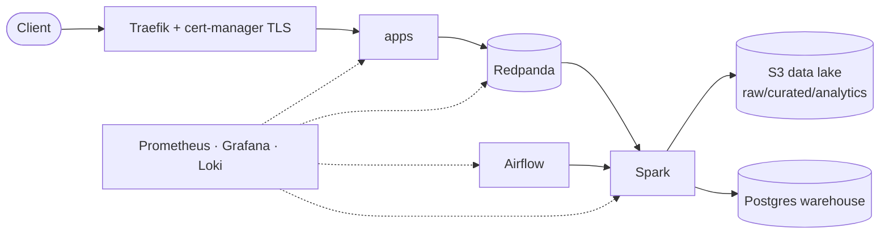

# terraform-advanced-data-platform

[](https://github.com/OWNER/terraform-advanced-data-platform/actions/workflows/terraform-plan.yml)
[](https://github.com/OWNER/terraform-advanced-data-platform/actions/workflows/security-scan.yml)


A production-style, cloud-native **data-engineering platform** defined entirely as Terraform:
network, KMS/IAM, S3 data lake, Kubernetes, Redpanda (Kafka API), Spark, Airflow, Postgres warehouse and a
Prometheus/Grafana/Loki observability stack, with secure CI/CD, policy-as-code and layered tests.
It runs **free** locally (LocalStack + kind); the EKS/RDS paths are written and plan-able but not applied by default.

> ⚠️ **Status:** authored without the ability to execute Terraform. It has **never been applied**.
> Read [docs/VERIFY.md](docs/VERIFY.md) first; expect to fix a few version-specific details on first run.

## Architecture


More in [docs/architecture.md](docs/architecture.md). Decisions in [docs/decisions/](docs/decisions/).

## Repository layout

| Path | Why it exists |
|---|---|
| `modules/` | Reusable, environment-agnostic building blocks (network, security, storage, compute, kubernetes, database, streaming, processing, monitoring, ci-cd) |
| `environments/{dev,staging,prod}/NN-*/` | **Composition**: each numbered folder is a separate root module with its **own state**; envs differ by `terraform.tfvars` |
| `global/` | Things that exist once: `state-bootstrap` (the state bucket), `iam` (OIDC + CI roles), `dns` |
| `charts/` | Local Helm chart for CRD-backed objects (avoids the "CRD doesn't exist at plan time" trap) |
| `policies/` | OPA/Rego (enforced) and Sentinel (learning) |
| `tests/` | `unit/` (`terraform test`, mocked), `integration/` (Terratest) |
| `.github/workflows/` | plan, apply (promotion), reusable stack workflow, security scans, drift detection |
| `scripts/`, `Makefile` | Named, documented commands; derive state keys from paths |
| `docs/` | Architecture, runbook, ADRs, internals, state-surgery lab, learning map, cost, portfolio kit |

## Technologies
Terraform ≥ 1.11 · AWS provider 6 (LocalStack locally) · kind · Helm · Cilium · Traefik · cert-manager ·
Redpanda · Spark Operator · Airflow · Postgres · kube-prometheus-stack · Loki · Grafana Alloy ·
GitHub Actions (OIDC) · OPA/Conftest · Checkov · Trivy · TFLint · Terratest.

## Prerequisites
Docker (**≥ 8 GB RAM allocated; 16 GB comfortable**), Terraform ≥ 1.11 (`.terraform-version`), `kubectl`, `helm`, `kind`
(optional CLI for debugging), AWS CLI. Optional: `tflint`, `conftest`/`opa`, `trivy`, `checkov`, Go (integration tests).

## Setup & deployment (local, $0)

```bash
make up                         # 1. start LocalStack (check docs/VERIFY.md re: LocalStack auth token)
make bootstrap                  # 2. create the state bucket (local state, one time)
export TF_VAR_airflow_admin_password='choose-something'   # never put this in a file

make apply ENV=dev STACK=10-network
make apply ENV=dev STACK=15-data-lake
make apply ENV=dev STACK=20-cluster      # creates the kind cluster (nodes NotReady until step 30)
make apply ENV=dev STACK=30-platform     # Cilium, ingress, cert-manager, monitoring
make apply ENV=dev STACK=40-data-services
# or all in order: make apply-all ENV=dev

kubectl --context kind-dp-dev get pods -A
open http://grafana.localtest.me         # password: kubectl -n monitoring get secret kps-grafana -o jsonpath='{.data.admin-password}' | base64 -d
```
Tear down: `kind delete cluster --name dp-dev && make down`.

### What `make apply` really runs
`scripts/stack.sh` → `terraform init -backend-config=<env>/backend-<mode>.hcl -backend-config=key=<env>/<stack>.tfstate`,
`terraform plan -out=tfplan`, `terraform apply tfplan`. The key is derived from the path so stacks can't share a state by mistake.

### Real AWS (optional, costs money)
Read [docs/cost.md](docs/cost.md). Set a budget alert first. Fill `backend-aws.hcl`, then `MODE=aws make plan ENV=staging STACK=10-network`.
Staging/prod are **plan-only reference configs** by design.

## Testing

| Layer | Command | Needs |
|---|---|---|
| Format/validate | `make fmt validate` | Terraform |
| Lint | `make lint` | TFLint |
| Security | `make scan` | Trivy, Checkov |
| Unit (mocked, no cloud) | `make test` | Terraform ≥ 1.7 |
| Policy | `make policy ENV=dev STACK=10-network` (after `make plan`) | Conftest |
| Integration | `make up && make integration` | Go + LocalStack |

When to use which: static/unit on every commit (seconds, free); policy/security on every PR; integration nightly (slow, needs infra).

## Security

- **No stored cloud credentials in CI**: GitHub OIDC; apply role trusts only the approval-gated Environment.
- **Secrets never in state** (DB/warehouse passwords): ephemeral + write-only. Documented exception: Helm values (ADR 0007).
- **Least privilege**: zone-scoped S3 policy, per-env state prefixes, permission boundary on CI roles.
- **Encryption**: KMS at rest (S3, state, secrets, EKS secrets), TLS-only bucket policies, TLS in Redpanda via cert-manager.
- **Network**: private subnets, locked default SG, NACLs, default-deny Kubernetes NetworkPolicies enforced by Cilium, metadata-service egress blocked.
- **Supply chain**: pinned providers + committed lock file, pinned chart versions, SHA-pinned actions, Dependabot.
- **Gates**: TFLint, Trivy, Checkov, gitleaks, OPA on the plan JSON.

## Cost considerations
Local is $0. NAT, EKS, RDS, load balancers, DNS and KMS bill on real AWS; all are opt-in; the PR plan prints `COST:` warnings. See [docs/cost.md](docs/cost.md).

## Troubleshooting
| Symptom | Likely cause / first command |
|---|---|
| `Error acquiring the state lock` | Another run active, or a dead run: runbook → *State lock* |
| `init` can't reach `localhost:4566` | `make up`; `curl localhost:4566/_localstack/health` |
| Helm `context deadline exceeded` | RAM/quota/netpol: `kubectl -n <ns> get events --sort-by=.lastTimestamp` |
| Nodes `NotReady` after stack 20 | Expected until Cilium installs in stack 30 |
| Pods can't talk across namespaces | NetworkPolicy; add the namespace to `peers` |
| Unsupported argument `data_wo` etc. | Provider too old: docs/VERIFY.md |
| Workflow: "unable to resolve action" | Replace `REPLACE_WITH_FULL_SHA` (`make pin-actions`) |

Debug toolbox: `TF_LOG=debug`, `terraform console`, `terraform state list/show`, `terraform graph`, `terraform providers schema -json`.
See [docs/runbook.md](docs/runbook.md) and [docs/internals.md](docs/internals.md).

## Lessons learned
*(Fill in from your real run; recruiters value specifics. Prompts to start from:)*
- What did you get wrong on the first `validate`/`apply`, and how did you find it?
- Which stack boundary did you redraw, and why?
- What did the policy/scan gates catch that you'd have missed?

## Future improvements
Multi-account (state/security/workload) and multi-region with provider aliases · external-secrets for Helm secrets ·
Argo CD for the `apps` layer · VPC flow logs + S3 access logging · Karpenter · Terragrunt/Atmos comparison ·
OPA in HCP Terraform or Sentinel enforcement · automated Infracost estimates in PRs · tag-pinned module registry releases.

## Documentation index
[architecture](docs/architecture.md) · [runbook](docs/runbook.md) · [internals](docs/internals.md) ·
[state surgery lab](docs/state-surgery.md) · [learning map](docs/learning-map.md) · [cost](docs/cost.md) ·
[VERIFY](docs/VERIFY.md) · [portfolio kit](docs/portfolio.md) · [ADRs](docs/decisions/)
