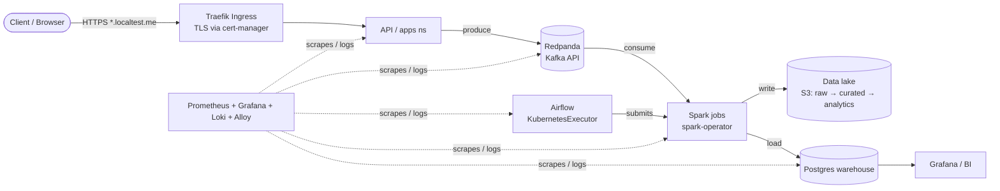
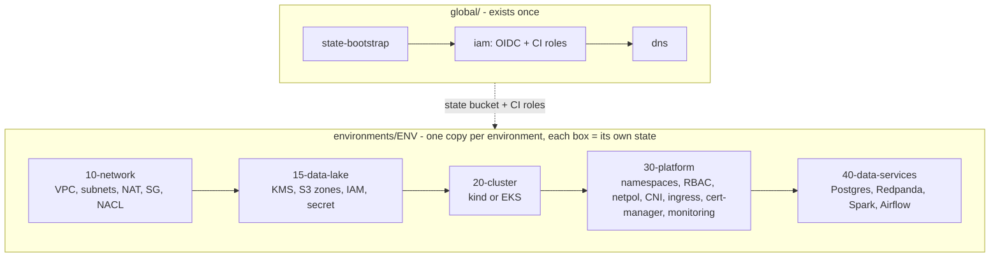

# Architecture

## Data flow

## Infrastructure layers (and the Terraform stack that owns each)

## Why stacks are split this way

| Stack | Changes | Blast radius | Credentials needed |
|---|---|---|---|
| 10-network | rarely | huge (everything lives in it) | cloud |
| 15-data-lake | rarely | data + keys | cloud |
| 20-cluster | rarely | all workloads | cloud |
| 30-platform | weekly | cluster add-ons | cluster admin |
| 40-data-services | often | data services | cluster admin + secrets |

Applications (`apps` namespace workloads, image tags) are **deliberately not here**. See ADR 0005.

## Kubernetes namespaces

| Namespace | Isolation | Purpose |
|---|---|---|
| ingress, cert-manager | open | Cluster edge |
| monitoring | privileged PSA (node-exporter), open | Observability |
| streaming | default-deny + peers | Redpanda |
| data | default-deny + peers + egress | Spark jobs, Postgres |
| orchestration | default-deny + peers + egress | Airflow |
| apps | default-deny + peers | Your services |

## Network security layers

1. **Security groups** (stateful, per-resource) → 2. **NACLs** (stateless, per-subnet) →
3. **Kubernetes NetworkPolicies** (per-pod, enforced by Cilium) → 4. **TLS in transit** (cert-manager) →
5. **KMS encryption at rest**.
